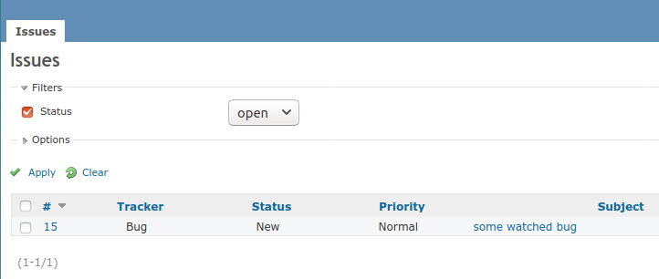

# Redmine Extended Watchers

In plain Redmine, non member users of a project can be added as issue watchers by member users, but nevertheless the watcher user does not gain any additional view permission either on the watched issue  nor the container project. This is rather misleading and prevents a scenario where a project member wants to engage a non-member user over a specific issue without the need to change overall project permissions and disclose further details.

This plug-in allows to unambiguously add a watcher to an issue if and only if this provides additional view permissions to the watcher user. It adds two alternative behaviors to watchers management with a different scope: one removes ambiguity by applying a restriction to the users that can be added as watchers; the other, instead, extends the visibility permissions of the user.

Refer to the *Configuration* paragraph below for further details.

## Version

Tests are performed through [redmine_testsuites](https://github.com/maxrossello/redmine_testsuites) including all the plugins it supports.

The plugin version corresponds to minimum version of Redmine required. Look at dedicated branch for each Redmine version.

## Installation

Simply install the plug-in into the Redmine plugins folder and restart your server.

## Configuration

In the plugin configuration page the administrator can select one out of three watchers behavior.

 

* **Default**
  The Redmine default behavior is preserved. A user has issue view permission according to its role settings. A project member can add any user in the system as a watcher according to the user visibility that its role allows, nevertheless the watcher user does not gain any additional issue or project view permission, nor it gets notified via email for an issue change or a new comment added.
  
* **Extended**
  A project member can add any user in the system as a watcher according to the user visibility that its role allows. As a consequence, the issue is always visible to the watcher and issue changes are notified via email according to the user's settings, as long as the issue tracking module is enabled in the project. 
  
  If the container project was not already visible because of assigned roles, then it becomes accessible and visible also in the project list. However, only the issues module will be disclosed, whereas every other enabled module in the system (e.g. wiki, roadmaps, forums, news, etc.) will remain hidden.
  
  In summary, watching acts as a lightweight permission to access specific issues that allows to disclose single items to non members. Below is a screenshot depicting how a non-member user watching an issue would view the private project containing the watched issue
  
  
  
  
  Additional visibility applies to private issues too. It lasts until the issue is watched, and is removed thereafter.
  
* **Protected**
  A project member cannot assign a user to watch an issue, and a watcher cannot have additional view permission over an issue, unless either: 

  * the candidate watcher is a project member with a role that has at least *issues created by or assigned to the user* permission in the project (i.e. *view issues*) or,
  * the project is public, the candidate watcher has no role in the project, but the nonmember role has that permission

  As per Redmine policies:

  * the assigner must have *add watcher* permission; 
  * the nonmember role is considered if and only if the project is public and the candidate watcher has no other role in the project
  * the issue tracking module must be enabled in the project
  
  Watching an issue overtakes the visibility limitations of the user role(s) over the issue's tracker.
  
  As a consequence of watching under above conditions, the issue is always visible to the watcher and issue changes are notified via email according to the user's settings.
  Additional visibility applies to private issues too. It lasts until the issue is watched, and is removed thereafter.
  Note: a watcher user that looses view permissions because of role assignments still remains a watcher, but it will anyway have no visibility of the issue nor of the container project. However, it will regain additional permissions once it gains project access because of restored role permissions, unless the issue's watchers are pruned.